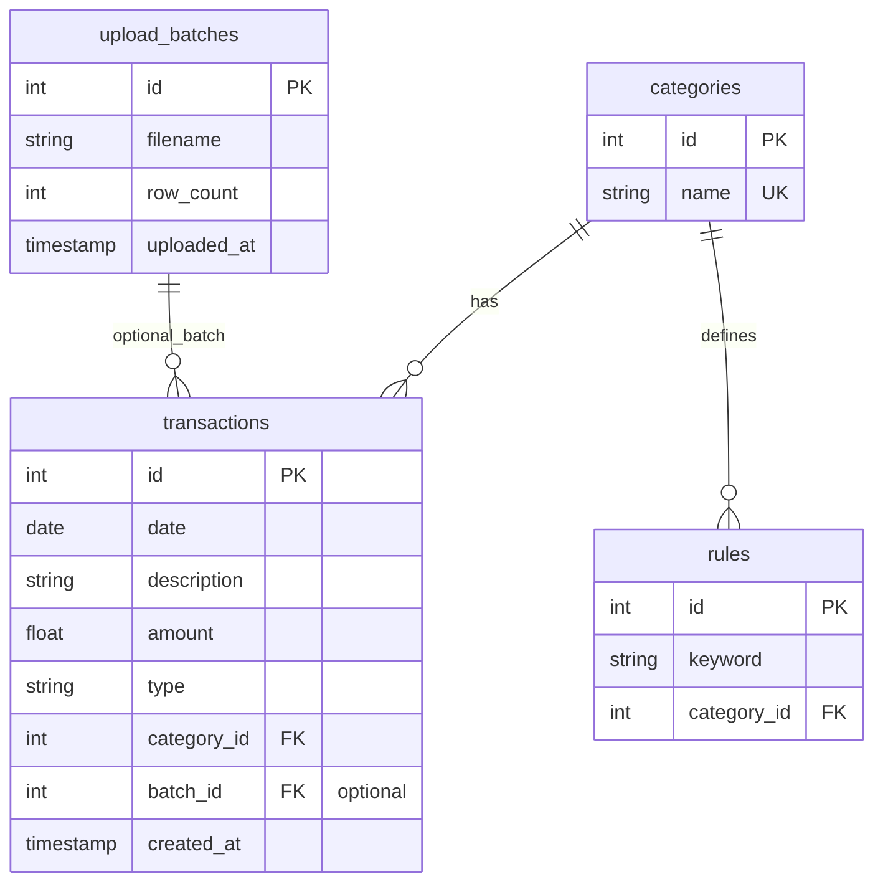

# Smart Expense Categorization — API & Database Design Document

**Purpose:** Single reference for REST endpoints (methods, paths, filters, bodies, responses), database schema, relationships, and ER diagram for the hackathon demo and judging Q&A.

---

## 1. Design principles (elevator line)

We designed **RESTful APIs** with **clear separation of concerns**: upload and processing on write paths; **read-optimized** list and summary endpoints using **pagination**, **indexed filters**, and **SQL aggregation** (`SUM`, `GROUP BY`) where possible—**minimal round-trips** to the database and **bulk insert** on CSV ingest (not row-by-row inserts in a loop).

---

## 2. Complete API reference

### 2.1 Conventions

| Item | Convention |
|------|------------|
| Base URL | e.g. `http://localhost:5000` or `/api` prefix — pick one and use consistently |
| JSON | `Content-Type: application/json` for JSON bodies and responses |
| CSV upload | `multipart/form-data`, field name: `file` |
| Dates | ISO `YYYY-MM-DD` where applicable |
| Errors | `{ "error": "message" }` with appropriate HTTP status (400, 404, 500) |

**Optional global query (when you support multiple uploads):** `batch_id` — scope transactions/summary/export to one upload.

---

### 2.2 Upload & processing

| Method | Path | Description |
|--------|------|-------------|
| `POST` | `/upload` | Upload CSV; parse, clean, categorize, **bulk** persist |

**Request**

- **Body:** `multipart/form-data`
  - `file` — CSV file (columns: `date`, `description`, `amount`, `type`)

**Response** `200 OK`

```json
{
  "message": "File processed successfully",
  "total_records": 50,
  "batch_id": 1
}
```

**Optimizations:** bulk insert; single pass over rows for cleaning + categorization.

---

### 2.3 Transactions

| Method | Path | Description |
|--------|------|-------------|
| `GET` | `/transactions` | Paginated list of all transactions |
| `GET` | `/transactions/filter` | Same data with **filters** (or merge filters into `/transactions` — see note) |

#### `GET /transactions`

**Query parameters**

| Param | Type | Required | Description |
|-------|------|----------|-------------|
| `page` | integer | no | Page number (default `1`) |
| `limit` | integer | no | Page size (default `20`, max e.g. `100`) |
| `batch_id` | integer | no | Limit to one upload batch |

**Response** `200 OK`

```json
[
  {
    "id": 1,
    "date": "2026-01-05",
    "description": "SWIGGY ORDER 45821",
    "amount": -620,
    "type": "debit",
    "category": "Food"
  }
]
```

*Alternative:* return `{ "items": [...], "total": 50, "page": 1, "limit": 20 }` for easier UI paging.

#### `GET /transactions/filter`

**Query parameters**

| Param | Type | Required | Description |
|-------|------|----------|-------------|
| `category` | string | no | Category name or slug (must match `categories.name`) |
| `type` | string | no | `credit` or `debit` |
| `start_date` | date | no | Inclusive |
| `end_date` | date | no | Inclusive |
| `page` | integer | no | Pagination |
| `limit` | integer | no | Pagination |
| `batch_id` | integer | no | Scope to upload |

**Response:** Same shape as `/transactions` list.

**Note:** You can implement **one** endpoint `GET /transactions` with all optional filters above to reduce duplication; judges accept either if documented.

**Optimizations:** indexes on `(date)`, `(category_id)`, `(type)`; paginated queries only.

---

### 2.4 Summary & analytics

| Method | Path | Description |
|--------|------|-------------|
| `GET` | `/summary` | Overall income, expense, net |
| `GET` | `/category-summary` | Spending (and/or income) **per category** |
| `GET` | `/top-category` | Highest spending category |
| `GET` | `/monthly-trend` | Month-wise totals for charts |

#### `GET /summary`

**Query parameters**

| Param | Type | Required | Description |
|-------|------|----------|-------------|
| `batch_id` | integer | no | Scope to one upload |

**Response** `200 OK`

```json
{
  "total_income": 50000,
  "total_expense": 20000,
  "net_balance": 30000
}
```

*Convention:* use `amount` sign and `type` consistently (e.g. expenses as positive numbers in summary for readability, or document if negatives).

#### `GET /category-summary`

**Query parameters**

| Param | Type | Required | Description |
|-------|------|----------|-------------|
| `batch_id` | integer | no | Scope to one upload |
| `type` | string | no | Optional: only `debit` or `credit` |

**Response** `200 OK`

```json
[
  { "category": "Food", "amount": 5000 },
  { "category": "Travel", "amount": 2000 }
]
```

**Optimization:** `SUM` + `GROUP BY` in SQL; avoid Python loops over all rows for aggregates.

#### `GET /top-category`

**Query parameters**

| Param | Type | Required | Description |
|-------|------|----------|-------------|
| `batch_id` | integer | no | Scope to one upload |

**Response** `200 OK`

```json
{
  "category": "Shopping",
  "amount": 12000
}
```

#### `GET /monthly-trend`

**Query parameters**

| Param | Type | Required | Description |
|-------|------|----------|-------------|
| `batch_id` | integer | no | Scope to one upload |
| `year` | integer | no | Filter by year |

**Response** `200 OK`

```json
[
  { "month": "2026-01", "amount": 20000 },
  { "month": "2026-02", "amount": 18500 }
]
```

---

### 2.5 Categories & rules (dynamic rule engine)

| Method | Path | Description |
|--------|------|-------------|
| `GET` | `/categories` | List all categories |
| `GET` | `/rules` | List all keyword → category mappings |
| `POST` | `/rules` | Add a keyword rule |

#### `GET /categories`

**Response** `200 OK`

```json
[
  { "id": 1, "name": "Food" },
  { "id": 2, "name": "Travel" }
]
```

#### `GET /rules`

**Response** `200 OK`

```json
[
  { "id": 1, "keyword": "swiggy", "category_id": 1, "category": "Food" }
]
```

#### `POST /rules`

**Request body** `application/json`

```json
{
  "keyword": "blinkit",
  "category_id": 1
}
```

**Response** `201 Created`

```json
{
  "id": 42,
  "keyword": "blinkit",
  "category_id": 1
}
```

**Optimization:** cache rules in memory after load/updates for fast categorization.

---

### 2.6 Export

| Method | Path | Description |
|--------|------|-------------|
| `GET` | `/export` | Download categorized CSV |

**Query parameters**

| Param | Type | Required | Description |
|-------|------|----------|-------------|
| `batch_id` | integer | no | Which upload to export (required if multiple batches exist) |

**Response** `200 OK` — `Content-Type: text/csv` + `Content-Disposition: attachment; filename="categorized_transactions.csv"`

---

## 3. Endpoint summary (quick lookup)

| Method | Endpoint | Main filters / body |
|--------|----------|----------------------|
| `POST` | `/upload` | `file` (multipart) |
| `GET` | `/transactions` | `page`, `limit`, `batch_id` |
| `GET` | `/transactions/filter` | `category`, `type`, `start_date`, `end_date`, `page`, `limit`, `batch_id` |
| `GET` | `/summary` | `batch_id` |
| `GET` | `/category-summary` | `batch_id`, `type` |
| `GET` | `/top-category` | `batch_id` |
| `GET` | `/monthly-trend` | `batch_id`, `year` |
| `GET` | `/categories` | — |
| `GET` | `/rules` | — |
| `POST` | `/rules` | JSON: `keyword`, `category_id` |
| `GET` | `/export` | `batch_id` |

---

## 4. Database design overview

- **Engine:** SQLite for hackathon (swap to PostgreSQL for production).
- **Normalized:** `categories` and `rules` separated from `transactions` for flexibility and performance (`category_id` FK).

---

## 5. Tables & DDL

### 5.1 `categories` (master list)

```sql
CREATE TABLE categories (
    id INTEGER PRIMARY KEY AUTOINCREMENT,
    name TEXT UNIQUE NOT NULL
);
```

**Example seed (align names with problem statement):**

| id | name |
|----|------|
| 1 | Salary / Income |
| 2 | Rent |
| 3 | Food |
| 4 | Travel |
| 5 | Shopping |
| 6 | Bills & Utilities |
| 7 | Entertainment |
| 8 | Healthcare |
| 9 | Insurance |
| 10 | Savings / Transfers |
| 11 | Investments / Interest |
| 12 | Other |

### 5.2 `rules` (keyword → category)

```sql
CREATE TABLE rules (
    id INTEGER PRIMARY KEY AUTOINCREMENT,
    keyword TEXT NOT NULL,
    category_id INTEGER NOT NULL,
    FOREIGN KEY (category_id) REFERENCES categories(id)
);
```

**Example**

| keyword | category |
|---------|----------|
| swiggy | Food |
| zomato | Food |
| uber trip | Travel |
| ola | Travel |
| amazon india | Shopping |

*Optional:* unique `(keyword)` or `(keyword, category_id)` depending on whether one keyword maps to one category only.

### 5.3 `transactions` (core fact table)

```sql
CREATE TABLE transactions (
    id INTEGER PRIMARY KEY AUTOINCREMENT,
    date DATE NOT NULL,
    description TEXT NOT NULL,
    amount REAL NOT NULL,
    type TEXT NOT NULL,              -- 'credit' / 'debit'
    category_id INTEGER NOT NULL,
    created_at TIMESTAMP DEFAULT CURRENT_TIMESTAMP,
    FOREIGN KEY (category_id) REFERENCES categories(id)
);
```

**Optional columns (recommended for hackathon spec):**

- `batch_id` — FK to an `upload_batches` table if you track multiple CSV uploads.
- `description_raw` — original text; `description` = cleaned text for matching.

### 5.4 Optional: `upload_batches`

```sql
CREATE TABLE upload_batches (
    id INTEGER PRIMARY KEY AUTOINCREMENT,
    filename TEXT,
    uploaded_at TIMESTAMP DEFAULT CURRENT_TIMESTAMP,
    row_count INTEGER
);
```

Then add `batch_id INTEGER REFERENCES upload_batches(id)` to `transactions`.

### 5.5 Optional: `summary` (materialized / cache)

```sql
CREATE TABLE summary (
    id INTEGER PRIMARY KEY AUTOINCREMENT,
    batch_id INTEGER,
    total_income REAL,
    total_expense REAL,
    last_updated TIMESTAMP DEFAULT CURRENT_TIMESTAMP
);
```

Not required if you compute aggregates on read with fast SQL.

---

## 6. Relationships

- **categories (1) → (many) transactions** — each transaction has one category.
- **categories (1) → (many) rules** — each rule points to one category; many keywords can map to the same category.

**Verbal ER:** Transactions store money facts; categories are the dimension table; rules are the configurable mapping layer for the rule engine.

---

## 7. ER diagram

### 7.1 Mermaid (render in GitHub, Notion, or Mermaid Live Editor)



### 7.2 ASCII overview

```
[ upload_batches ] (optional)
        |
        v
[ transactions ] -----> [ categories ]
                               ^
                               |
                          [ rules ]
```

---

## 8. How the system uses the database (processing flow)

1. CSV uploaded → parse rows (`date`, `description`, `amount`, `type`).
2. Clean `description` for matching; load **rules** (from DB or cache).
3. For each row: find first matching keyword rule → resolve `category_id` → else `Other`.
4. **Bulk insert** into `transactions`.
5. Summary APIs run **aggregations** in SQL (`SUM`, `GROUP BY`, `ORDER BY` for top category).

---

## 9. Sample SQL (impress judges)

**Total expense per category (debits):**

```sql
SELECT c.name, SUM(t.amount) AS total_amount
FROM transactions t
JOIN categories c ON t.category_id = c.id
WHERE t.type = 'debit'
GROUP BY c.name
ORDER BY total_amount ASC;
```

*Adjust `SUM(ABS(t.amount))` if amounts are stored negative for debits.*

---

## 10. Quick pitch lines

- **APIs:** “RESTful design with paginated reads, filterable transactions, and aggregation-heavy summary endpoints—minimal DB chatter, bulk writes on upload.”
- **Database:** “Normalized schema: transactions linked to categories, with a dedicated rules table for keyword mapping so we can extend categories and keywords without code changes.”

---

## 11. FAQ (judges)

| Question | Answer |
|----------|--------|
| Why a separate `rules` table? | Change keyword mappings at runtime or via admin without redeploying code. |
| Why `category_id` instead of repeating category text? | No redundancy, smaller rows, consistent naming, faster joins and indexes. |
| Can this scale? | Yes: move SQLite → PostgreSQL; add indexes; optional Redis cache for rules. |

---

*Document version: 1.0 — aligned with HCL-style hackathon requirements (CSV, rule-based categorization, UI + APIs).*

---

## 12. Visualization stack (Matplotlib + Seaborn)

To make the analytics output presentation-ready, the project includes a visualization module at:

- `core/visualizer.py`

### Libraries used

- `pandas` — grouping and reshaping (`groupby`, pivot)
- `numpy` — numeric helpers (outlier/correlation calculations)
- `matplotlib` — base plotting and figure saving
- `seaborn` — statistical chart styles and high-level plots

### Output format

- All charts are saved as **PNG files** under:
  - `data/charts/`
- Each chart function returns:

```json
{
  "chart_path": "data/charts/<chart_name>.png",
  "insight": "1-2 line interpretation"
}
```

### Notes on Matplotlib usage

- Matplotlib is explicitly used for:
  - figure creation (`plt.subplots`)
  - axis/labels/titles
  - saving images (`fig.savefig(..., dpi=120)`)
- Seaborn charts are still rendered on Matplotlib axes.
- Combined dashboard charts are generated via Matplotlib subplot layout.
